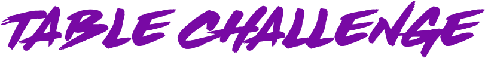

  </a>

<h1 align="center">
  
  
  
  
</h1>
 

## ℹ️ Sobre

Desafio criado para os desenvolvedores em formação testarem suas habilidades criando páginas estáticas somente com HTML e CSS, sendo **obrigatório** que todo HTML seja feito por **table**.

Essa ideia surgiu quando eu, uma desenvolvedora backend, com ranço absoluto de CSS, precisei desenvolver um template de um formulário para exportação de pdf.

Foi um dos maiores desafios que enfrentei até aqui nessa minha curta carreira. Mas também mostro que, apesar de todo sofrimento, é possível ser feito e muito bem feito.

E aí quem vai topar o desafio???
  
 

## 📋 Regras

- Fazer o fork do repositório, criar sua branch e desenvolver um dos modelos de formulários contido na pasta template.
- Fazer pull request para o repositório, colocando nos comentários qual modelo escolhido, quais alterações foram feitas.
- Lembrando que não deverão ser utilizados frameworks e que todo HTML deverá ser composto de table.
- Poderão ser feitas as seguintes alterações nos modelos:
  - cor
  - imagens
  - fontes
- Além dos modelos serão fornecidos os links para as imagens no canvas... assim as mesmas poderão ser aproveitadas caso você opte somente por alteração na cor.

- Deverá ser criada uma pasta com seu usuário do github, onde conterá o arquivo html e o arquivo css, e o link para a mesma deverá ser incluído na página index.html.

- O projeto será publicado no Github Pages, mas somente aparecerão os formulários aprovados na review.

## 🔗 Links úteis

### Imagens no Canvas
- [Link 1](https://www.canva.com/design/DAFg7S_emGM/lGpGLoZD2594SwGKycG0Ww/view?utm_content=DAFg7S_emGM&utm_campaign=designshare&utm_medium=link&utm_source=publishsharelink&mode=preview)

- [Link 2](https://www.canva.com/design/DAFg7e_PZJ4/Ijj1ap6sUlObe9QBL61PHA/view?utm_content=DAFg7e_PZJ4&utm_campaign=designshare&utm_medium=link&utm_source=publishsharelink&mode=preview)

- [Link 3](https://www.canva.com/design/DAFg7UFjRuM/V8XXxltp6RjjrnQGfjJN1Q/view?utm_content=DAFg7UFjRuM&utm_campaign=designshare&utm_medium=link&utm_source=publishsharelink&mode=preview)

- [Link 4](https://www.canva.com/design/DAFg7bfFwTQ/fRYc-aguCPflcsyObltU0w/edit?utm_content=DAFg7bfFwTQ&utm_campaign=designshare&utm_medium=link2&utm_source=sharebutton)

### Table HTML
- [W3 School](https://www.w3schools.com/html/html_tables.asp)
- [MDN](https://developer.mozilla.org/en-US/docs/Learn/HTML/Tables/Basics)

### Table CSS
- [W3 School](https://www.w3schools.com/css/css_table.asp)
- [MDN](https://developer.mozilla.org/en-US/docs/Learn/CSS/Building_blocks/Styling_tables)
## ⁉️ Dúvidas e sugestões

- Para dúvidas e sugestões, abrir uma **issue** no próprio repositório.
- Encontrou uma documentação legal? Inclua no README.
- Encontrou um modelo legal para praticarmos? Compartilha o png e/ou imagens aqui no repositório.
  - O formulário deverá estar em png e as imagens serem um link do canvas ou do figma para que possa ser manipulada.

 

## 👩‍💼 Autora

<b>Nádia Ligia, back-end developer.</b>

&nbsp;
&nbsp;

